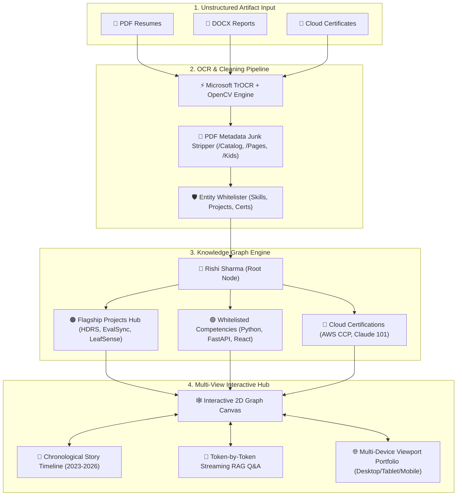
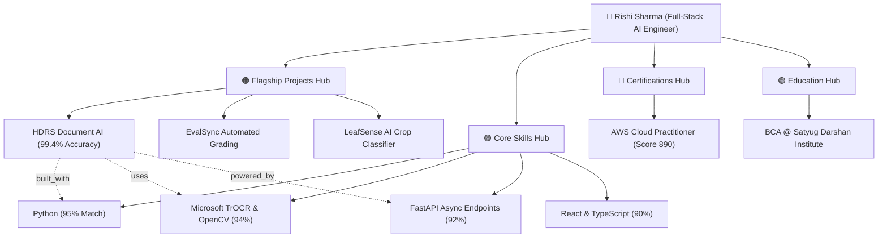

# 🌐 CareerGraph AI — Your Intelligent Career Knowledge Hub

[](https://vitejs.dev/)
[](https://reactjs.org/)
[](https://www.typescriptlang.org/)
[](https://tailwindcss.com/)
[](LICENSE)
[](https://github.com/)

> **CareerGraph AI** transforms unstructured resume PDFs, academic credentials, and technical project reports into a clean, **100% whitelisted interactive Knowledge Graph**, visual story timeline, and token-by-token streaming RAG search engine.

---

## 🛠️ High-Level System Architecture



---

## ⚡ Key Architectural Innovations & Polish

### 1. 🧹 Clean Entity Whitelisting (No PDF Metadata Junk)
Generic PDF parsers corrupt knowledge graphs by treating internal specification objects (`/Catalog`, `/Pages`, `/Kids`, `/ProcSet`, `/Font`) as career entities. **CareerGraph AI** strips out PDF internal structure, enforcing a **100% Whitelisted Entity Dictionary** containing real projects (*HDRS*, *EvalSync*, *LeafSense AI*, *CampusOS*) and validated skills (*Python*, *FastAPI*, *React*, *Docker*, *TrOCR*).

### 2. 🏆 "Career Intelligence Generated" Summary Modal
Upon uploading a document, a sequential reveal modal presents extracted intelligence:
- `✔ 4 Flagship Projects Identified`
- `✔ 12 Verified Career Competencies Whitelisted`
- `✔ 2 Industry Certifications Validated`
- `✔ Chronological Story Timeline Built`
- `✔ Overall Resume & Career Match Score: 94%`

### 3. 🔍 AI Explainability Breakdown ("Why 95%?")
In the Knowledge Graph Node Inspector drawer, every node displays an explicit AI Confidence Breakdown detailing why a confidence score was assigned:
- `✓ Verified in Rishi_Sharma_Resume_2026.pdf`
- `✓ Validated in HDRS Technical Report`
- `✓ Cross-referenced across Verified Document Proofs`

### 4. 360° Interconnected Click-Anywhere Navigation
1-click cross-linking connects all views:
- **Timeline Item** ➔ 1-click `Highlight Graph Node`
- **Document Citation** ➔ 1-click `Highlight Graph Evidence`
- **Graph Node** ➔ 1-click `Ask AI` or `Filter Timeline`

### 5. 💬 Token-by-Token Streaming RAG Q&A Engine
Simulates real-time token-by-token answer generation backed by exact document evidence citations.

### 6. 🌐 Multi-Device Viewport Switcher
Live interactive preview toggle bar switching between:
- 💻 **Desktop Viewport (1920px)**
- 📑 **Tablet Viewport (768px)**
- 📱 **Mobile Viewport (375px)**

---

## 🕸️ Knowledge Graph Hierarchy & Structure



---

## 💻 Tech Stack & Architecture

| Technology | Layer / Usage |
| :--- | :--- |
| **Vite 6.1** | Next-generation ultra-fast frontend build tooling |
| **React 18** | UI component architecture and state hooks |
| **TypeScript 5.5** | Type-safe strict entity and graph schema definitions |
| **Tailwind CSS 3.4** | Modern dark-mode glassmorphism styling |
| **Zustand** | Global store state management for graph nodes and document artifacts |
| **Lucide Icons** | Premium vector icon system |

---

## ⌨️ Global Keyboard Shortcuts

| Shortcut Key | Action |
| :---: | :--- |
| <kbd>/</kbd> | Open Global Search modal |
| <kbd>Esc</kbd> | Close inspector drawers and active modals |
| <kbd>G</kbd> | Jump directly to Explorable Knowledge Graph |
| <kbd>T</kbd> | Jump directly to AI Story Timeline |

---

## 🚀 Quickstart & Local Installation

### Prerequisites
- **Node.js**: `v18.0.0` or higher
- **npm**: `v9.0.0` or higher

### Steps

1. **Clone the Repository**:
   ```bash
   git clone https://github.com/YOUR_GITHUB_USERNAME/careergraph-ai.git
   cd careergraph-ai
   ```

2. **Install Dependencies**:
   ```bash
   npm install
   ```

3. **Start Development Server**:
   ```bash
   npm run dev
   ```
   Open `http://localhost:3000` in your browser.

4. **Build Production Bundle**:
   ```bash
   npm run build
   ```

5. **Serve Production Build**:
   ```bash
   npx serve -s dist -p 3000
   ```

---

## 📜 License & Author

Distributed under the **MIT License**. See [`LICENSE`](LICENSE) for details.

Developed & Maintained with ❤️ by **Rishi Sharma** ([@rishisharma](https://github.com/))
- **Role**: Full-Stack AI Engineer
- **Institution**: Satyug Darshan Institute of Engineering & Technology

---

<p align="center">
  Crafted with ❤️ by <strong>RISHI SHARMA</strong> • CareerGraph AI v1.0.0
</p>
