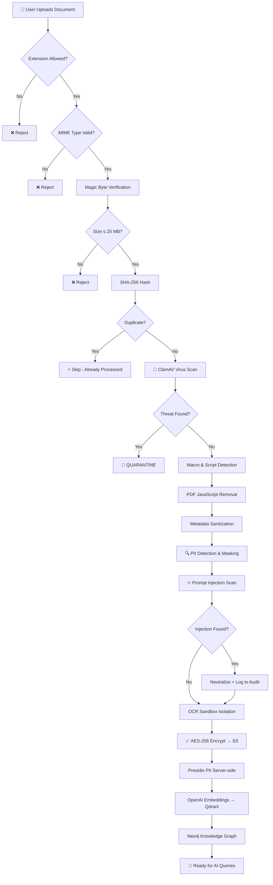
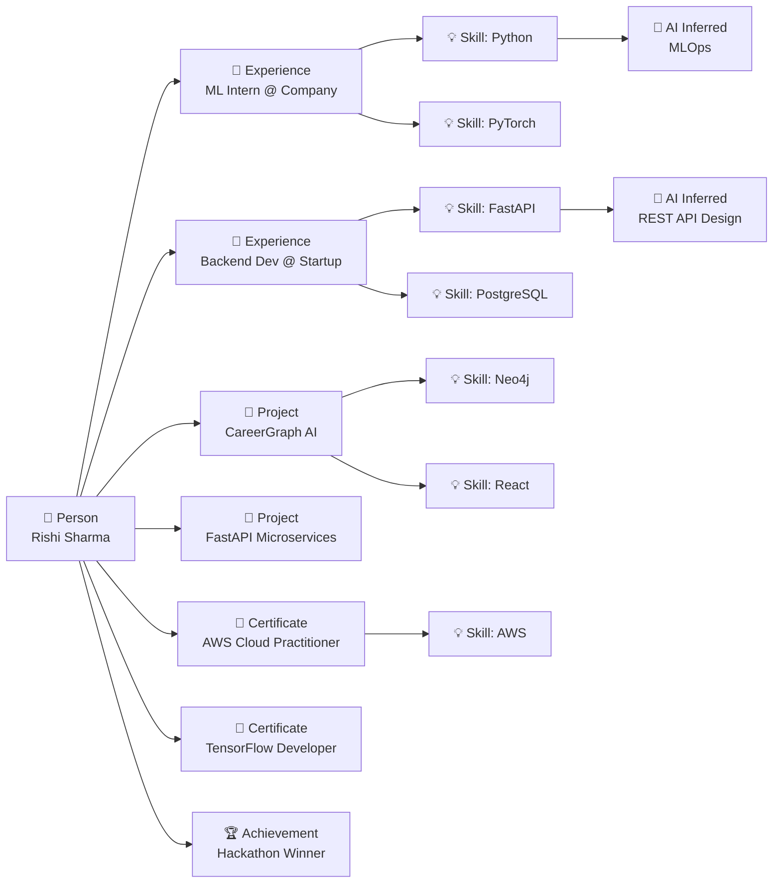
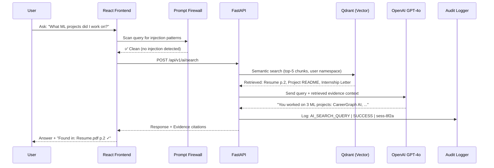
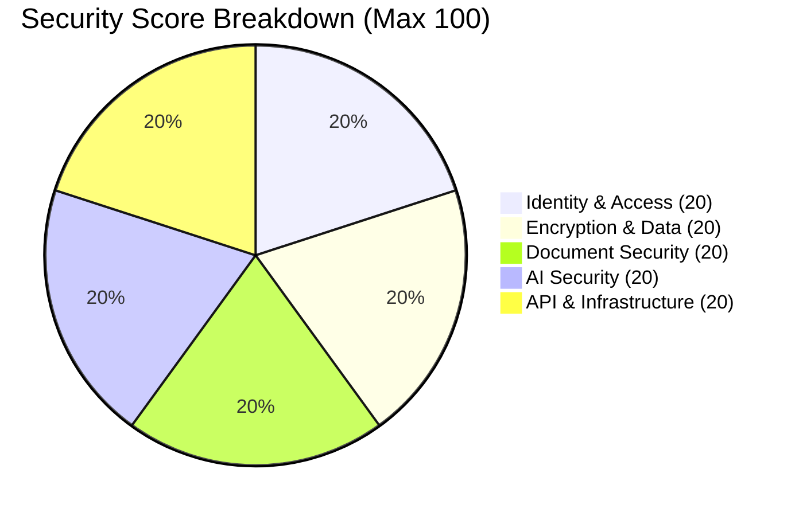
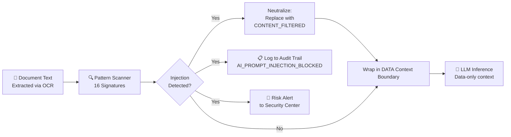
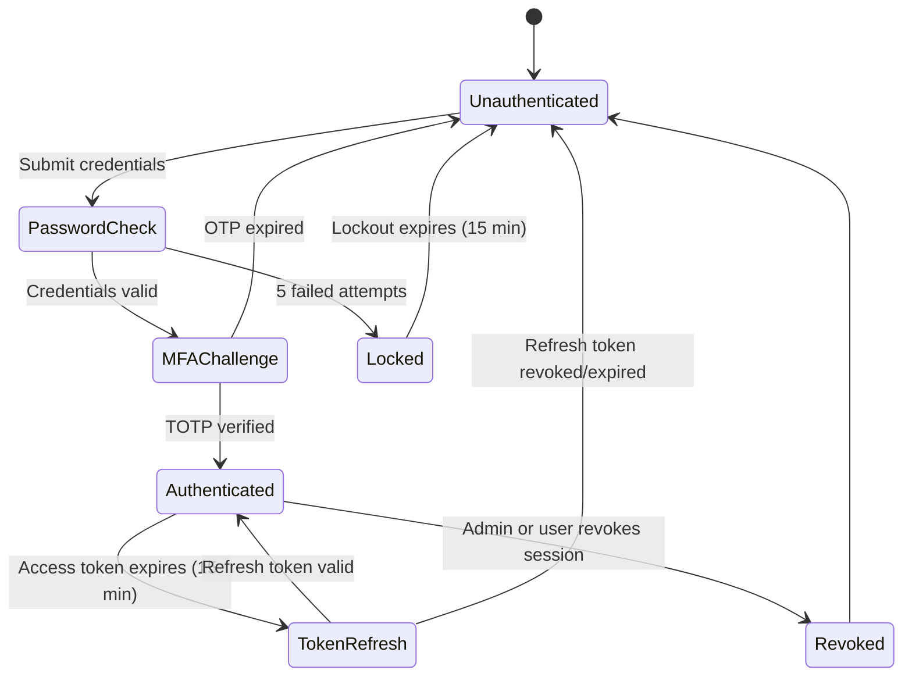

<div align="center">

# 🧠 CareerGraph AI

### Your Intelligent Career Knowledge Hub

**v2.0 — Enterprise Security Suite**

[](https://rishisharma029.github.io/careergraph-ai/)
[](https://github.com/Rishisharma029/careergraph-ai/actions)
[](https://rishisharma029.github.io/careergraph-ai/)
[](https://github.com/Rishisharma029/careergraph-ai/releases)
[](https://www.typescriptlang.org/)
[](https://react.dev/)
[](https://vitejs.dev/)
[](./LICENSE)
[](./SECURITY.md)

> **CareerGraph AI** transforms your resume, certificates, and projects into a living knowledge graph.  
> Ask anything about your career. Get answers backed by evidence. Export AI-powered resumes.

[**🌐 Live Demo →**](https://rishisharma029.github.io/careergraph-ai/) · [**Security Policy**](./SECURITY.md) · [**Threat Model**](./THREAT_MODEL.md) · [**Changelog**](#-changelog)

</div>

---

## 📋 Table of Contents

1. [What is CareerGraph AI?](#-what-is-careergraph-ai)
2. [Feature Overview](#-feature-overview)
3. [Architecture](#-architecture)
4. [Security Architecture](#-security-architecture)
5. [Tech Stack](#-tech-stack)
6. [Getting Started](#-getting-started)
7. [Project Structure](#-project-structure)
8. [Roadmap](#-roadmap)
9. [Security Disclosure](#-security-disclosure)
10. [Changelog](#-changelog)
11. [License](#-license)

---

## 🧠 What is CareerGraph AI?

CareerGraph AI converts unstructured career documents into a **queryable, visual knowledge graph**. Instead of reading a resume, a recruiter (or the AI) can traverse a graph of skills, projects, certificates, and experiences — all with evidence traces back to the original documents.

```
Resume.pdf  ──▶  OCR + NLP  ──▶  Knowledge Graph  ──▶  AI Answers + Evidence
Certificates ──▶  Parser    ──▶  Skill Nodes       ──▶  "Found in: Resume.pdf p.2"
Projects ────▶  Analyser   ──▶  Achievement Edges  ──▶  Confidence: 97%
```

---

## ✨ Feature Overview

| Feature | Description | Status |
|---|---|---|
| 🗺️ **Knowledge Graph** | Interactive Neo4j-powered career graph with physics, clustering, pinning | ✅ v1.0 |
| 📄 **Document Upload Studio** | Drag-and-drop upload with 13-step security pipeline | ✅ v1.0 |
| 🤖 **AI Search & Chat** | RAG-grounded answers with evidence explorer | ✅ v1.0 |
| 📈 **Skill Analytics** | Radial gauges, trend charts, skill gap analysis | ✅ v1.0 |
| 🕐 **Career Timeline** | Interactive milestone timeline with document links | ✅ v1.0 |
| 🎬 **Masterclass Splash** | Cinematic onboarding sequence | ✅ v1.0 |
| 🛡️ **Security Center** | 7-tab enterprise security dashboard | ✅ v2.0 |
| 🔐 **MFA + RBAC** | TOTP multi-factor auth, 4-role permission matrix | ✅ v2.0 |
| 🔥 **Prompt Firewall** | 16-signature injection detection + context boundary wrapping | ✅ v2.0 |
| 🧬 **PII Masking Engine** | Aadhaar, PAN, Passport, Email, Phone auto-masking | ✅ v2.0 |
| 📋 **Enterprise Audit Log** | 16-field structured audit trail (SOC 2 aligned) | ✅ v2.0 |
| 🏛️ **Privacy Center** | GDPR / DPDP Act 2023 consent + data rights | ✅ v2.0 |
| 👔 **Recruiter Portal** | JD upload, candidate scoring, shortlisting | ✅ v1.0 |
| 🎤 **Interview Simulator** | AI-powered mock interviews | ✅ v1.0 |

---

## 🏗️ Architecture

### System Architecture

```
┌─────────────────────────────────────────────────────────────────────┐
│                        CareerGraph AI                               │
│                   Full-Stack Architecture                           │
└─────────────────────────────────────────────────────────────────────┘

  ┌──────────────┐
  │  User Browser│
  │  React + TS  │
  └──────┬───────┘
         │ HTTPS (TLS 1.3)
  ┌──────▼───────────────────┐
  │   Nginx — TLS + CSP      │
  │   Rate Limiting Headers   │
  └──────┬───────────────────┘
         │ HTTP (internal)
  ┌──────▼───────────────────────────────────────────────────────────┐
  │                    FastAPI Backend                               │
  │  ┌──────────┐  ┌──────────┐  ┌──────────┐  ┌───────────────┐  │
  │  │  Auth    │  │  RBAC    │  │  Rate    │  │  Input        │  │
  │  │  JWT/MFA │  │  Guards  │  │  Limit   │  │  Validation   │  │
  │  └──────────┘  └──────────┘  └──────────┘  └───────────────┘  │
  └──────────────────────────────────────────────────────────────────┘
         │                │               │
  ┌──────▼──────┐  ┌──────▼──────┐  ┌───▼──────────┐
  │   Neo4j     │  │   Qdrant    │  │  PostgreSQL   │
  │  Knowledge  │  │   Vector    │  │  Audit Logs   │
  │  Graph      │  │  Embeddings │  │  User Store   │
  └─────────────┘  └─────────────┘  └──────────────┘
         │                │
  ┌──────▼──────┐  ┌──────▼──────┐
  │   Redis     │  │   S3 +      │
  │  Rate Limit │  │  AES-256    │
  │  Cache      │  │  Storage    │
  └─────────────┘  └─────────────┘
```

### Document Processing Pipeline



### Knowledge Graph Data Model



### AI Search & RAG Flow



---

## 🛡️ Security Architecture

### 7-Layer Defence Model

```mermaid
graph TD
    subgraph Layer1["🔐 Layer 1 — Identity & Access"]
        L1A["JWT RS256 Tokens<br/>15 min TTL"]
        L1B["MFA TOTP<br/>Authentication"]
        L1C["RBAC<br/>4 Roles"]
        L1D["Session Revocation<br/>Per-device"]
    end

    subgraph Layer2["🔒 Layer 2 — Data & Encryption"]
        L2A["AES-256-GCM<br/>At Rest"]
        L2B["TLS 1.3<br/>In Transit"]
        L2C["Signed URLs<br/>5 min expiry"]
        L2D["PII Masking<br/>6 Identifier Types"]
    end

    subgraph Layer3["📄 Layer 3 — Document Security"]
        L3A["13-Step<br/>Threat Pipeline"]
        L3B["ClamAV<br/>Virus Scan"]
        L3C["Quarantine<br/>Path"]
        L3D["SHA-256<br/>Integrity Check"]
    end

    subgraph Layer4["🤖 Layer 4 — AI Security"]
        L4A["Prompt Injection<br/>Firewall"]
        L4B["RAG Evidence<br/>Grounding"]
        L4C["Tenant<br/>Isolation"]
        L4D["Confidence<br/>Threshold Gate"]
    end

    subgraph Layer5["🌐 Layer 5 — API & Infrastructure"]
        L5A["Rate Limiting<br/>100 req/min"]
        L5B["Security Headers<br/>CSP + HSTS"]
        L5C["CORS<br/>Whitelist"]
        L5D["Input<br/>Validation"]
    end

    subgraph Layer6["👁️ Layer 6 — Observability"]
        L6A["Structured Audit<br/>Logs 16 Fields"]
        L6B["Risk Alert<br/>Engine"]
        L6C["WORM<br/>Log Storage"]
        L6D["Security<br/>Timeline"]
    end

    subgraph Layer7["🏛️ Layer 7 — Privacy & Compliance"]
        L7A["GDPR<br/>Right to Erasure"]
        L7B["Consent<br/>Management"]
        L7C["SOC 2 Aligned<br/>Controls"]
        L7D["DPDP Act 2023<br/>India"]
    end

    Layer1 --> Layer2 --> Layer3 --> Layer4 --> Layer5 --> Layer6 --> Layer7
```



### Security Score Calculation



> Score is **dynamically calculated** from real feature state — not a static number.
> Toggling MFA off immediately reduces the Identity score by 10 points.

### Prompt Injection Defence Flow



### Session Management Flow



---

## 🧰 Tech Stack

### Frontend

| Technology | Version | Purpose |
|---|---|---|
| React | 18 | UI framework |
| TypeScript | 5.0 | Type safety |
| Vite | 6.1 | Build tool |
| Zustand | 4.x | State management |
| CSS (Vanilla) | — | Styling |
| React Force Graph | — | Knowledge graph canvas |

### Backend (Production Architecture)

| Technology | Purpose |
|---|---|
| FastAPI (Python 3.12) | REST API, auth middleware, rate limiting |
| LangGraph | AI agent orchestration |
| Neo4j 5.x | Knowledge graph (Cypher queries) |
| Qdrant | Vector embeddings (namespaced per tenant) |
| PostgreSQL 16 | Users, audit logs, metadata |
| Redis 7 | Rate limiting (token bucket), session cache |
| OpenAI GPT-4o | RAG inference engine |
| ClamAV | Virus / malware detection |
| Microsoft Presidio | Server-side PII masking |

### DevSecOps

| Tool | Purpose |
|---|---|
| Gitleaks | Hardcoded secret detection |
| Snyk | Dependency vulnerability scanning |
| CodeQL | Static analysis security testing (SAST) |
| OWASP Dependency Check | CVE matching for dependencies |
| Trivy | Container image vulnerability scanning |
| Docker + Docker Compose | Containerised production stack |
| Nginx | TLS termination, security headers, CSP |

---

## 🚀 Getting Started

### Prerequisites

```bash
node >= 18.0.0
npm >= 9.0.0
git
```

### 🌐 Live Demo

> **Try it now — no setup required:**
> ## [https://rishisharma029.github.io/careergraph-ai/](https://rishisharma029.github.io/careergraph-ai/)
> Deployed automatically via GitHub Actions on every push to `main`.

### Installation

```bash
# Clone the repository
git clone https://github.com/Rishisharma029/careergraph-ai.git
cd careergraph-ai

# Install dependencies
npm install

# Start development server
npm run dev
```

Open `http://localhost:5173` in your browser.

### Production Build

```bash
# Build for production
npm run build

# Preview production build locally
npx serve -s dist -p 3000
```

### Docker (Full Stack)

```bash
# Copy environment template
cp .env.example .env
# Fill in your API keys and passwords

# Start full security stack
docker compose -f docker-compose.security.yml up -d
```

---

## 📁 Project Structure

```
careergraph-ai/
├── src/
│   ├── components/
│   │   ├── common/
│   │   │   ├── MasterclassSplash.tsx       # Cinematic onboarding sequence
│   │   │   ├── GlobalSearchModal.tsx       # Cmd+K command palette
│   │   │   ├── EvidenceExplorerModal.tsx   # AI answer evidence viewer
│   │   │   ├── InterviewSimulatorModal.tsx # AI mock interviews
│   │   │   ├── LearningPlannerModal.tsx    # AI learning path generator
│   │   │   ├── VoiceAISimulator.tsx        # Voice AI interface
│   │   │   └── DocumentDiffModal.tsx       # Document comparison
│   │   └── layout/
│   │       ├── Navbar.tsx
│   │       └── Sidebar.tsx
│   ├── pages/
│   │   ├── Landing/         # Marketing landing page
│   │   ├── Dashboard/       # Home dashboard
│   │   ├── Upload/          # Document upload studio
│   │   ├── KnowledgeGraph/  # Interactive graph canvas
│   │   ├── Timeline/        # Career timeline
│   │   ├── Search/          # AI search & chat
│   │   ├── Analytics/       # Skill analytics
│   │   ├── Profile/         # AI resume export
│   │   ├── RecruiterPortal/ # Recruiter JD matching
│   │   └── Security/        # 🆕 Enterprise Security Center (v2.0)
│   ├── security/            # 🆕 Core Security Module (v2.0)
│   │   ├── rbac/
│   │   │   ├── permissions.ts              # RBAC permission matrix
│   │   │   └── useRBAC.ts                 # Runtime permission hook
│   │   ├── audit/
│   │   │   └── useAuditLogger.ts          # 16-field structured audit log
│   │   └── threat/
│   │       ├── useThreatEngine.ts         # 13-step document pipeline
│   │       ├── usePromptFirewall.ts       # Injection detection + neutralization
│   │       └── usePIIDetector.ts          # PII masking engine
│   ├── store/
│   │   ├── useAuthStore.ts
│   │   └── useSecurityStore.ts            # 🆕 Dynamic 5-category security score
│   └── types/
├── .github/
│   └── workflows/
│       └── security.yml                   # 🆕 DevSecOps CI/CD pipeline
├── docker-compose.security.yml            # 🆕 7-service production stack
├── THREAT_MODEL.md                        # 🆕 STRIDE threat analysis
├── SECURITY.md                            # 🆕 Vulnerability disclosure policy
├── CODE_OF_CONDUCT.md
├── CONTRIBUTING.md
└── LICENSE
```

---

## 🗺️ Roadmap

### ✅ v1.0 — Masterclass Release
- [x] Knowledge Graph with physics (force-directed, pinning, clustering)
- [x] Document Upload Studio
- [x] AI Search with RAG evidence grounding
- [x] Career Timeline with milestone editor
- [x] Skill Analytics (radial gauges, trend charts)
- [x] Recruiter Portal with candidate scoring
- [x] AI Profile Exporter (resume generation)
- [x] Cinematic Masterclass splash onboarding
- [x] Command palette (`/` or `Ctrl+K`)
- [x] Keyboard shortcuts (`G` → Graph, `T` → Timeline)

### ✅ v2.0 — Enterprise Security Suite
- [x] 7-tab Security Center dashboard
- [x] MFA (TOTP) with score integration
- [x] RBAC permission matrix (4 roles)
- [x] Per-device session management + revocation
- [x] 13-step document threat pipeline (interactive demo)
- [x] PII masking engine (6 identifier types)
- [x] Prompt injection firewall (16 signatures)
- [x] 16-field enterprise audit logger
- [x] Dynamic security score (not hardcoded)
- [x] GDPR / DPDP Act privacy center with consent management
- [x] DevSecOps CI/CD pipeline (8 security jobs)
- [x] Docker Compose production stack (7 services + ClamAV)
- [x] STRIDE threat model documentation

### 🔮 v3.0 — Real Backend (Planned)
- [ ] FastAPI + LangGraph real backend connection
- [ ] Real Neo4j knowledge graph (live Cypher queries)
- [ ] Real Qdrant vector store (namespaced per user)
- [ ] Real document OCR (Microsoft TrOCR / Azure Document Intelligence)
- [ ] Multi-user SaaS (login, own graph, own AI)
- [ ] Live career twin AI

### 🔮 v4.0 — Scale (Planned)
- [ ] Collaborative graph (team skill map)
- [ ] Recruiter Portal as separate service
- [ ] AI Learning Planner (week-by-week path generation)
- [ ] GitHub, LinkedIn, LeetCode integration
- [ ] Real-time notifications

---

## 🔒 Security Disclosure

Please **do not open public GitHub issues** for security vulnerabilities.

Report privately via [GitHub Security Advisories](https://github.com/Rishisharma029/careergraph-ai/security/advisories) or see [SECURITY.md](./SECURITY.md) for the full coordinated disclosure policy.

**Security Controls Implemented:**
- ✅ JWT RS256 + Refresh Token Rotation
- ✅ MFA (TOTP Authenticator App)
- ✅ Role-Based Access Control (4 roles)
- ✅ AES-256-GCM Encryption at Rest
- ✅ TLS 1.3 in Transit
- ✅ ClamAV Virus Scanning
- ✅ Prompt Injection Firewall (16 signatures)
- ✅ PII Auto-Masking (Aadhaar, PAN, Passport, Email, Phone)
- ✅ 16-Field Structured Audit Logging
- ✅ Rate Limiting (100 req/min per IP)
- ✅ Security Headers (CSP, HSTS, X-Frame-Options)
- ✅ DevSecOps CI/CD (Gitleaks, Snyk, CodeQL, Trivy)

> **Compliance Note**: Security controls are aligned with SOC 2 Type II principles, OWASP Top 10, and GDPR / DPDP Act 2023. CareerGraph AI does not hold SOC 2 certification — "Aligned" means architectural and control-level alignment, not audit certification.

---

## 📝 Changelog

### [v2.0.0] — 2026-07-29 — Enterprise Security Suite

#### 🆕 Added
- **Security Center** — 7-tab enterprise dashboard (Overview, Identity, Data, AI, Documents, Audit, Privacy)
- **RBAC Module** — `src/security/rbac/` — permission matrix for Admin, Recruiter, Candidate, Guest
- **Audit Logger** — `src/security/audit/` — 16-field structured audit events (SOC 2 aligned)
- **Threat Engine** — `src/security/threat/useThreatEngine.ts` — interactive 13-step document pipeline
- **PII Masking Engine** — Aadhaar, PAN, Passport, Email, Phone, Bank Account detection
- **Prompt Injection Firewall** — 16 pattern signatures, context boundary wrapping, jailbreak detection
- **Dynamic Security Score** — 5 categories, derived from real feature state (no hardcoded numbers)
- **MFA Toggle** — Live-updates security score when toggled
- **Session Management** — Per-device revocation, untrusted device flagging, revoke-all
- **Privacy Center** — GDPR consent toggles, data export/deletion, transparency table
- **STRIDE Threat Model** — `THREAT_MODEL.md` — full threat analysis with 25+ scenarios
- **DevSecOps Pipeline** — `.github/workflows/security.yml` — Gitleaks, Snyk, CodeQL, OWASP, Trivy
- **Docker Compose** — `docker-compose.security.yml` — 7 services including ClamAV
- **SECURITY.md** — Coordinated disclosure policy, severity classification, response timeline
- **Updated .gitignore** — Added secrets, CI reports, Python backend, Docker volumes

#### 🔧 Changed
- `src/store/useSecurityStore.ts` — Complete rewrite with dynamic scoring and enterprise sessions
- `src/pages/Security/Security.tsx` — Complete rewrite with 7 tabs (530+ lines)
- `src/App.tsx` — Fixed "SOC2 Secure" → "SOC 2 Aligned Controls" (compliance accuracy)
- `README.md` — Complete rewrite with architecture diagrams, flowcharts, STRIDE references

#### 🐛 Fixed
- Corrected misleading "SOC 2 Secure" label to "SOC 2 Aligned Controls" in footer
- Fixed `SecurityCenter` default export import in App.tsx

---

### [v1.0.0] — 2026-07-28 — Masterclass Release

#### 🆕 Added
- Knowledge Graph with force-directed physics, node pinning, cluster expansion
- Edge tracing SVG animations (electric trail effect)
- Masterclass Splash — cinematic "Building your Career Intelligence..." onboarding
- Document Upload Studio with drag-and-drop
- AI Search with RAG evidence grounding
- Career Timeline with milestone editor
- Skill Analytics with radial gauges and trend charts
- Recruiter Portal with JD matching and candidate scoring
- AI Profile Exporter with resume generation
- Interview Simulator modal
- Learning Planner modal
- Command palette (`/` or `Ctrl+K`)
- Keyboard shortcuts (G → Graph, T → Timeline)
- Voice AI Simulator

---

## 👤 Author

**Rishi Sharma**

> Built with ❤️ as a Masterclass in AI-powered career intelligence.

[](https://github.com/Rishisharma029)

---

## 📄 License

This project is licensed under the **MIT License** — see [LICENSE](./LICENSE) for details.

---

<div align="center">

**CareerGraph AI v2.0 — Enterprise Security Suite**

*Security controls aligned with SOC 2 principles · OWASP Top 10 mitigations · Zero Trust Architecture*

</div>
